# CareTrack

Clinical referral and workflow management platform demonstrating secure, role-based healthcare operations with Angular, ASP.NET Core, Azure SQL, and Microsoft Entra ID.

**Live application:** [caretrack.hussnainali.me](https://caretrack.hussnainali.me) — recruiter demo access is available from the **Interactive Demo** section. No password is published in this repository.

> **Synthetic data only.** CareTrack is an independent portfolio project. It is not affiliated with, endorsed by, commissioned by, or certified by the NHS or any healthcare provider, and it is not presented as clinically approved or ready for real patient care.

## 1. Overview

CareTrack models the staff workflow around patient registration, referrals, triage, assignment, appointments, and Clinical Notes. It was built to demonstrate how explicit domain rules, application-layer orchestration, reliable SQL transactions, and API-enforced authorization fit together in a deployed full-stack system.

The public landing page explains the product without authentication; the authenticated workspace uses real Microsoft Entra identities and entirely synthetic records.

## 2. Live Demo

- Frontend: [https://caretrack.hussnainali.me](https://caretrack.hussnainali.me)
- API liveness: [https://caretrack-api-g3ghhnddhefvg8c4.centralus-01.azurewebsites.net/api/health](https://caretrack-api-g3ghhnddhefvg8c4.centralus-01.azurewebsites.net/api/health)
- Interactive access: choose a role on the landing page, copy the displayed credentials, and continue through Microsoft sign-in

The demo is shared. Changes from previous visitors may be visible and can be removed by a manual reset. Never enter real patient, clinical, or personal information.

See the [recruiter demo guide](docs/13-recruiter-demo.md) for a short walkthrough.

## 3. Why CareTrack

Healthcare workflow software has to make state, ownership, and access boundaries unambiguous. CareTrack turns that concern into a portfolio-sized system: a referral progresses only through supported transitions; scheduling coordinates referral and appointment state; clinical authorship comes from authenticated identity; and the API remains the final authorization boundary.

## 4. Core Features

- synthetic patient registration, search, detail, and optimistic-concurrency updates
- referral creation, submission, triage, information requests, acceptance/rejection, assignment, scheduling, progress, completion, and history
- referral-linked appointment scheduling with patient overlap protection
- explicit appointment check-in, start, completion, cancellation, and Did Not Attend outcomes
- clinician-only Clinical Note creation, reading, and editing with server-derived authorship
- Angular role-aware navigation, responsive UI, accessible demo dialog, and authenticated demo banner
- centralized Problem Details responses, sanitized production logging, and separate liveness/readiness endpoints

## 5. Interactive Demo Roles

| Role | Useful demo paths | Boundary |
| --- | --- | --- |
| Referral Coordinator | Register a synthetic patient; create, triage, assign, and progress referrals; schedule an eligible referral | Cannot read the full patient list, appointment workspace, appointment clinical actions, or Clinical Notes |
| Clinician | Read patients and appointments; perform the permitted referral workflow; schedule and progress appointments; create/update Clinical Notes | Receives only the policies granted to `Clinician`; demo metadata adds no permission |
| Administrator | Reserved for future system administration | No implicit clinical or referral-management bypass; no current admin feature is exposed |

`Clinician` intentionally satisfies both `ClinicianAccess` and `ReferralManagement`. Authorization is enforced by the API; hiding UI controls is presentation only.

## 6. Product Workflow

```mermaid
flowchart LR
    P[Register synthetic patient] --> R[Create referral]
    R --> T[Submit and triage]
    T --> A[Accept and assign]
    A --> S[Schedule appointment]
    S --> C[Check in and start]
    C --> N[Record Clinical Notes]
    N --> AC[Complete appointment]
    AC --> RC[Explicitly complete referral]
```

Appointment completion does not silently complete its referral. Referral completion remains an explicit operation and validates related appointment state. See [workflow documentation](docs/11-workflows.md).

## 7. Architecture

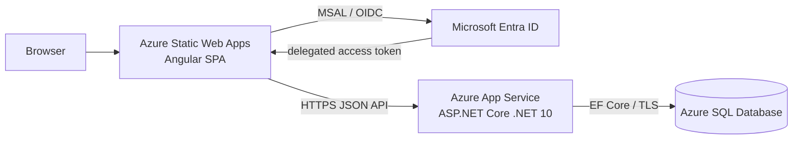

The backend follows Clean Architecture dependency direction: Domain contains invariants, Application coordinates use cases, Infrastructure implements persistence, and API owns HTTP, identity, policies, and composition. Read the [system architecture](docs/03-system-architecture.md) and [engineering decisions](docs/12-engineering-decisions.md).

## 8. Tech Stack

| Area | Technology |
| --- | --- |
| Frontend | Angular 22, TypeScript 6, RxJS, Signals, Reactive Forms, MSAL Angular, Vitest |
| Backend | C#, ASP.NET Core .NET 10, Microsoft.Identity.Web, Problem Details |
| Data | EF Core 10, SQL Server locally, Azure SQL Database serverless in production |
| Delivery | GitHub Actions, Azure Static Web Apps, Azure App Service |
| Testing | xUnit, ASP.NET Core integration testing, SQL Server-backed integration tests, Angular/Vitest |

## 9. Authentication & Authorization

The SPA uses the OAuth 2.0 Authorization Code Flow with PKCE through MSAL. Microsoft Entra ID issues an access token for the delegated `access_as_user` scope. The API validates that token with Microsoft.Identity.Web and applies named policies:

- `ApiAccess`: authenticated user plus delegated scope
- `ClinicianAccess`: scope plus `Clinician`
- `ReferralManagement`: scope plus `ReferralCoordinator` or `Clinician`
- `AdministrativeAccess`: scope plus `Administrator`

CareTrack stores no passwords and places no client secret in the SPA. `isDemoAccount` is response metadata used for the banner; it is never an authorization input. Details are in [authentication and authorization](docs/06-authentication-authorization.md).

## 10. Production Deployment

| Component | Hosting | Delivery |
| --- | --- | --- |
| Angular SPA | Azure Static Web Apps with custom domain | GitHub Actions production build and deployment |
| ASP.NET Core API | Azure App Service, .NET 10 | GitHub Actions restore, build, unit test, publish, deploy, and liveness verification |
| Database | Azure SQL Database serverless | Explicit EF Core migrations; no automatic startup migration |
| Identity | Microsoft Entra SPA and API app registrations | Delegated API scope and app-role assignments |

Secrets and production settings remain in Azure/GitHub configuration, not source. See [deployment](docs/10-deployment.md).

## 11. Reliability & Observability

- SQL transient retries are enabled with bounded retry settings.
- Multi-aggregate operations use explicit transactions and persisted-state verification for commit-ambiguous retries.
- Scheduling uses serializable isolation to protect overlap checks.
- `/api/health` is SQL-independent liveness; `/api/health/ready` verifies SQL connectivity.
- Production logs exclude tokens, request bodies, clinical content, raw route values, connection strings, and exception details returned to clients.
- App Service platform Health Check is **not enabled because the current free tier does not support it**. The readiness endpoint is implemented and ready for configuration after a plan upgrade.

## 12. Testing

The recorded pre-documentation baseline is:

| Suite | Result |
| --- | ---: |
| Backend unit tests | 249 passed |
| Backend integration tests | 198 passed |
| Frontend tests | 307 passed |
| Production Angular build | Passed |
| Backend Release build | Passed cleanly |

Coverage includes domain transitions, application orchestration, SQL persistence, migrations, authorization policies, 401/403 behavior, concurrency, transaction retry safety, demo reset guards, Angular components/services, and role-aware presentation. See the [testing strategy](docs/08-testing-strategy.md).

## 13. Demo Data & Reset Strategy

The deterministic baseline contains 12 patients, 17 referrals, 94 referral-history entries, 10 appointments, and 7 Clinical Notes. A guarded tool under `backend/tools/CareTrack.DemoSeeder` resets the shared `CareTrackDb` manually, refuses a different database name, requires exact confirmation, preserves migration history, and never runs at application startup.

Operational instructions are in [database seed data](database/seed/README.md).

## 14. Project Structure

```text
care-track/
├── backend/
│   ├── src/                 # Api, Application, Domain, Infrastructure
│   ├── tests/               # xUnit unit and SQL Server integration tests
│   └── tools/               # guarded deterministic demo seeder
├── frontend/caretrack-web/  # Angular SPA and public product assets
├── database/                # reset/seeding operational documentation
├── docs/                    # product, architecture, API, security, and portfolio docs
├── tools/                   # retained standalone Entra authentication test client
└── .github/workflows/       # frontend and backend CI/CD
```

The existing folder spelling `Persistance` is intentionally preserved.

## 15. Local Development

Prerequisites are .NET 10 SDK, Node.js 24 with npm, local SQL Server, and access to development Entra app-registration values. In outline:

```powershell
dotnet restore backend/CareTrack.slnx
dotnet build backend/CareTrack.slnx
dotnet run --project backend/src/CareTrack.Api/CareTrack.Api.csproj

Set-Location frontend/caretrack-web
npm ci
npm start
```

Local SQL, user-secret/environment settings, migration commands, integration tests, and demo-seeder use are documented in the [local development guide](docs/14-local-development.md).

## 16. Security & Privacy

- synthetic data only; no real patient or clinical information
- Entra-managed identities, passwords, MFA, and role assignments
- API-authoritative scope/role policies on every business endpoint
- no local credential store and no client-controlled Clinical Note author
- restricted production CORS origin and development-only OpenAPI
- secrets, tokens, connection strings, and publish profiles excluded from source

This demonstrates security-conscious engineering; it is not a claim of regulatory compliance. See [security](docs/09-security.md) and [clinical-risk awareness](docs/07-clinical-risk.md).

## 17. Portfolio Disclaimer

CareTrack is an independent, non-commercial portfolio demonstration using synthetic data. It is not affiliated with, endorsed by, commissioned by, deployed for, or certified by the NHS, University Hospitals Plymouth NHS Trust, or any other healthcare provider. It has not undergone clinical-safety assessment, penetration testing, regulatory approval, or measured production-scale validation.

## 18. Screenshots

All images below are existing captures of the actual application.

| Dashboard | Patients |
| --- | --- |
| 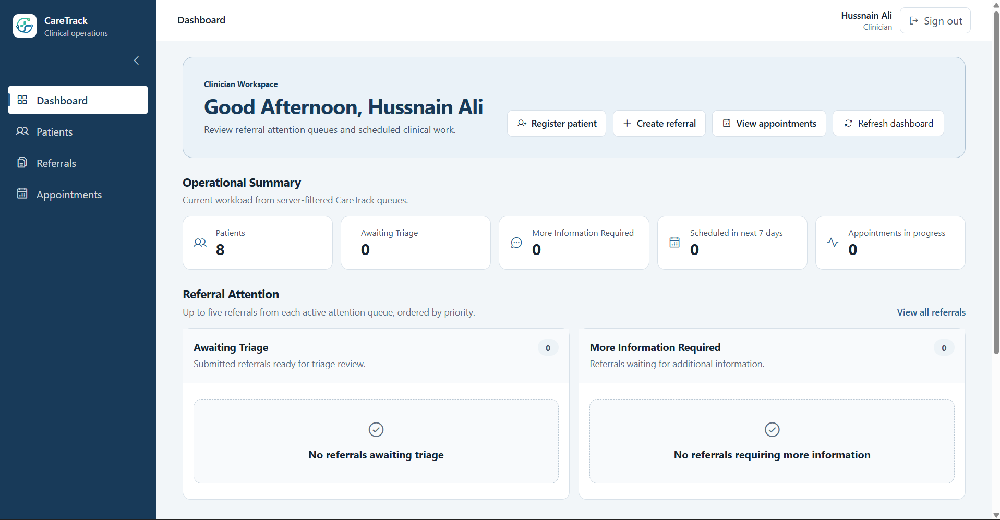 | 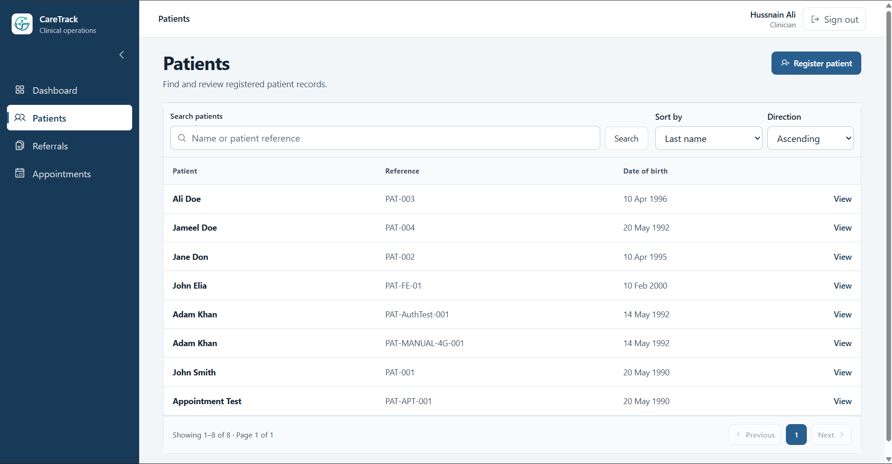 |

| Referrals | Referral detail |
| --- | --- |
| 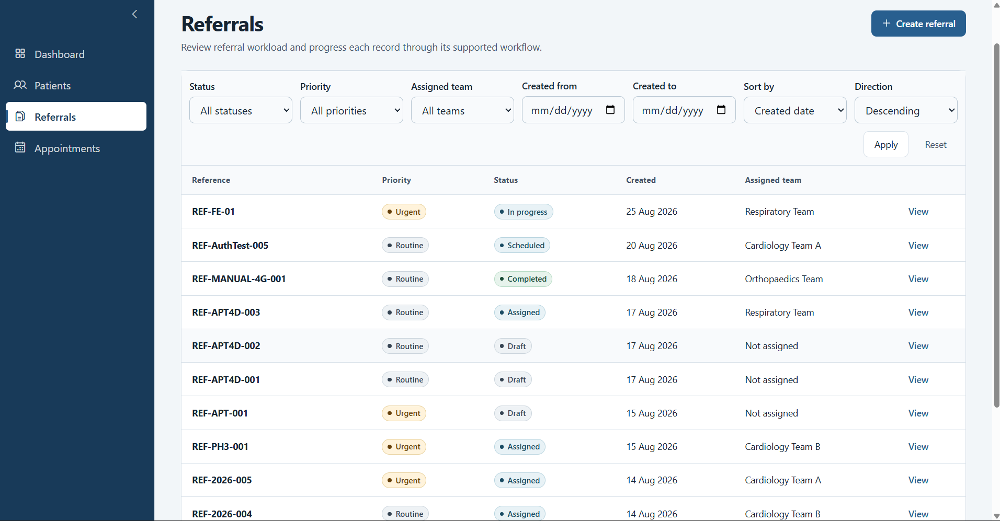 | 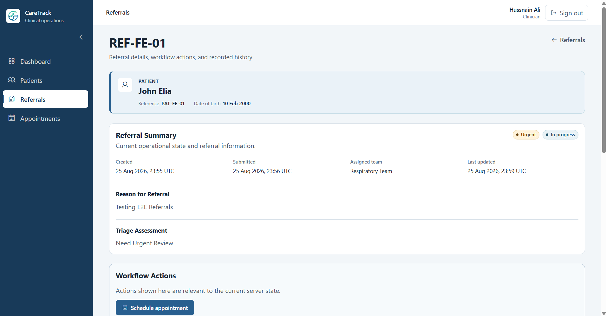 |

| Appointments |
| --- |
| 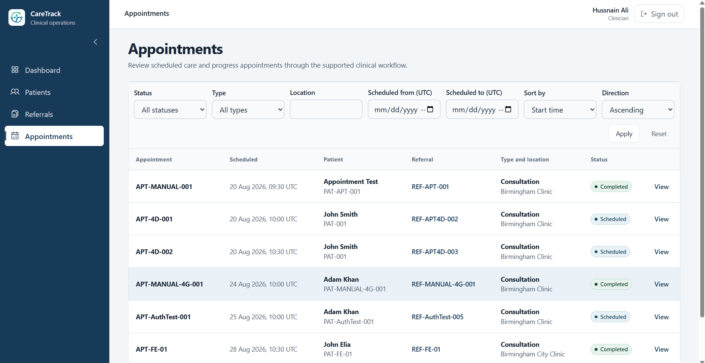 |

| Interactive Demo dialog | Referral Coordinator workspace |
| --- | --- |
| 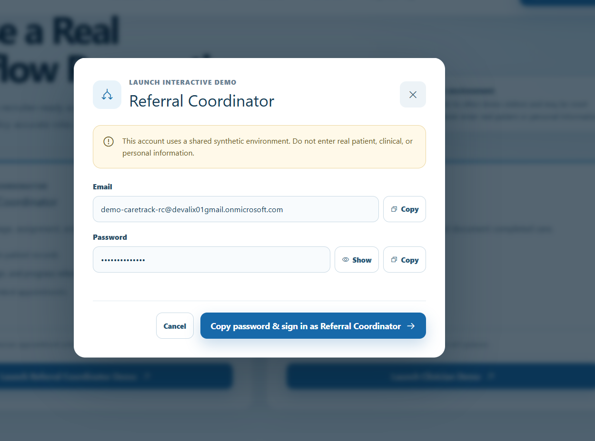 | 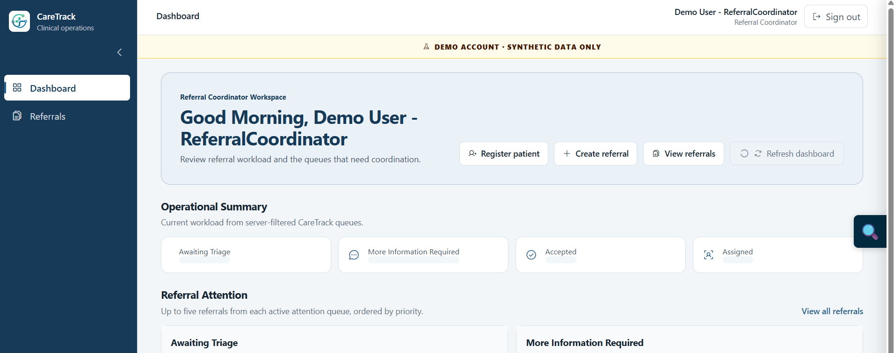 |

| Authenticated demo banner | Appointment detail with Clinical Notes |
| --- | --- |
| 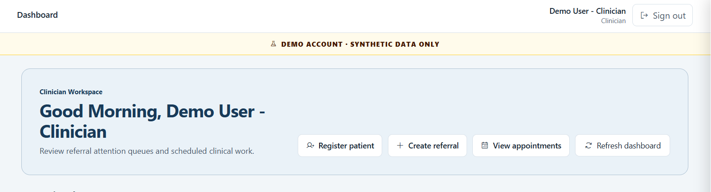 | 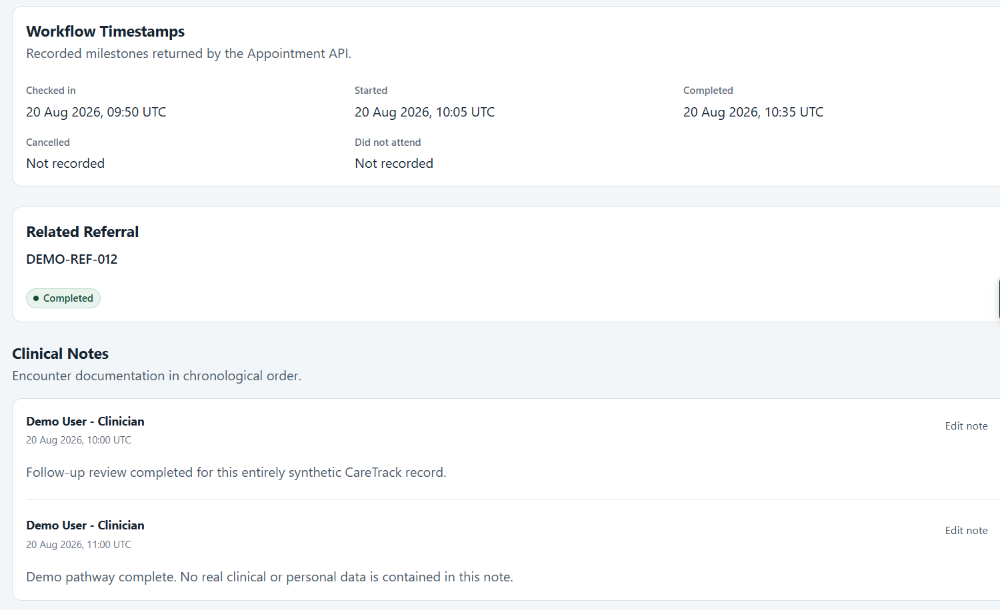 |

## 19. Engineering Highlights

- domain-owned state machines with endpoint-specific transitions instead of generic status mutation
- cross-aggregate orchestration in Application, keeping entities responsible for their own invariants
- retry-safe explicit transaction verification for transient and commit-ambiguous SQL failures
- strict API policy matrix with deterministic authentication/authorization integration tests
- accessible recruiter flow backed by real restricted Entra demo identities
- deterministic, guarded shared-demo reset that preserves EF migration history
- independently deployable Angular and ASP.NET Core pipelines with production health verification

Interview-ready project copy is available in [portfolio summary](docs/portfolio-summary.md).

## 20. Known Limitations / Future Improvements

- Shared demo visitors can see one another's synthetic changes; reset is manual rather than scheduled.
- Azure App Service free tier prevents platform Health Check configuration, although the readiness endpoint exists.
- Administrator policy exists but no administration feature is implemented.
- Integration tests expect a developer-provided local SQL Server database; the repository does not currently orchestrate a disposable Docker SQL container.
- There is no end-to-end browser suite, formal accessibility audit, penetration test, clinical-safety case, or load-test evidence.
- `Cancelled` exists in the referral enum, but the current domain exposes no referral-cancellation transition or API endpoint.

For the documentation map and cleanup notes, see [docs](docs/) and the [cleanup review](docs/15-cleanup-review.md).
