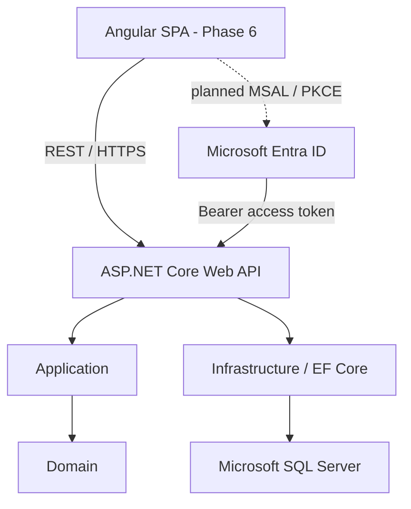

# CareTrack

## Clinical Referral & Workflow Management System

## 1. Overview

CareTrack is an independent portfolio demonstration of a staff-facing clinical referral and workflow management application.

The backend now implements a structured patient, referral, appointment, and clinical-note workflow using synthetic data only. Microsoft Entra ID is used for authentication, and ASP.NET Core named authorization policies enforce role-appropriate access.

CareTrack is not a production healthcare system and is not connected to real NHS systems.

## 2. Current Project Status

### Completed

- requirements and architecture foundation
- .NET backend solution and layered architecture
- SQL Server persistence with EF Core
- patient management
- referral workflow
- appointment scheduling and lifecycle
- clinical notes
- concurrency and transactional workflow hardening
- centralized API exception handling
- Microsoft Entra bearer authentication
- role/scope/policy authorization
- authenticated current-user abstraction
- deterministic authentication/authorization integration testing
- route-level security audit and hardening

### Next

**Phase 6 — Angular frontend + MSAL**

Planned next work:

- Angular application
- MSAL Angular
- Authorization Code Flow with PKCE
- authenticated API client
- role-aware navigation/views
- frontend forms and workflow UI

## 3. Core Workflow

### Referral

```text
Draft
→ Submitted
→ Awaiting Triage
→ Accepted
→ Assigned
→ Scheduled
→ In Progress
→ Completed
```

Alternative states include:

- More Information Required
- Rejected
- Cancelled

### Appointment

```text
Scheduled
→ Checked In
→ In Progress
→ Completed
```

Additional outcomes:

- Cancelled
- Did Not Attend

## 4. Current Roles

### ReferralCoordinator

- patient registration/update
- referral workflow management
- assignment/reassignment
- appointment creation/scheduling

### Clinician

- patient clinical reads
- appointment clinical workflow
- clinical notes
- also permitted by `ReferralManagement` where appropriate

### Administrator

- reserved for future administrative/system capabilities
- not a universal clinical superuser

### Patient

Patients are domain records in v1 and do not authenticate directly.

A future patient portal would require patient-to-identity mapping and resource-level authorization.

## 5. Technology Stack

### Implemented Backend

- C#
- .NET 10
- ASP.NET Core Web API
- Entity Framework Core
- LINQ
- Microsoft SQL Server
- Microsoft Entra ID
- Microsoft.Identity.Web
- OAuth 2.0 / OpenID Connect concepts
- xUnit
- ASP.NET Core integration testing
- OpenAPI in Development

### Planned Frontend

- Angular
- TypeScript
- MSAL Angular
- Angular Router
- Reactive Forms
- accessible responsive UI

### Planned Delivery

- Playwright
- GitHub Actions
- Azure and/or IIS deployment

## 6. Architecture



### Dependency Direction

```text
CareTrack.Api
  → CareTrack.Application
  → CareTrack.Infrastructure

CareTrack.Infrastructure
  → CareTrack.Application
  → CareTrack.Domain

CareTrack.Application
  → CareTrack.Domain

CareTrack.Domain
  → no project dependency
```

## 7. Authentication & Authorization

The API uses Microsoft Entra ID bearer authentication.

Delegated scope:

```text
access_as_user
```

Application roles:

```text
Clinician
ReferralCoordinator
Administrator
```

Named policies:

```text
ClinicianAccess
ReferralManagement
AdministrativeAccess
```

A request must be authenticated and satisfy the required scope/role policy.

Clinical-note `CreatedBy` is derived server-side from the authenticated Entra object ID and cannot be overridden by a client-supplied value.

## 8. API Security Model

Examples:

```text
Patients read/search
→ ClinicianAccess

Patients create/update
→ ReferralManagement

Referrals
→ ReferralManagement

Appointments create
→ ReferralManagement

Appointments read/workflow
→ ClinicianAccess

Clinical Notes
→ ClinicianAccess
```

`/api/health` is the anonymous SQL-independent liveness probe. `/api/health/ready` is the anonymous database readiness probe.

OpenAPI is exposed only in Development.

## 9. Testing

The backend includes:

- unit tests for domain/application behavior
- SQL Server-backed integration tests
- persistence tests
- workflow tests
- concurrency and rollback tests
- deterministic test authentication
- policy tests
- 401/403 authorization tests
- route-to-policy tests
- Clinical Note identity-spoofing tests

Integration tests keep anonymous clients anonymous and explicitly create authenticated test clients with the minimum required role/scope.

## 10. Repository Structure

```text
CareTrack/
├── backend/
│   ├── src/
│   │   ├── CareTrack.Api/
│   │   ├── CareTrack.Application/
│   │   ├── CareTrack.Domain/
│   │   └── CareTrack.Infrastructure/
│   └── tests/
│       ├── CareTrack.UnitTests/
│       └── CareTrack.IntegrationTests/
├── tools/
│   └── CareTrack.AuthTestClient/
├── docs/
└── .github/
```

The temporary authentication test client is retained until the Angular/MSAL client is working.

## 11. Documentation

- `docs/01-requirements.md`
- `docs/02-user-stories.md`
- `docs/03-system-architecture.md`
- `docs/04-database-design.md`
- `docs/05-api-design.md`
- `docs/06-authentication-authorization.md`
- `docs/07-clinical-risk.md`
- `docs/08-testing-strategy.md`
- `docs/09-security.md`
- `docs/10-deployment.md`

## 12. Data & Security Notice

CareTrack is designed for synthetic data only.

Do not use:

- real patient data
- production credentials
- real clinical information
- live healthcare integrations

No credentials, access tokens, secrets, or environment-specific private configuration should be committed to Git.

## 13. Disclaimer

**CareTrack is an independent portfolio demonstration using entirely synthetic data. It is not affiliated with, commissioned by, or endorsed by the NHS, University Hospitals Plymouth NHS Trust, or any other healthcare provider. It does not claim clinical-safety certification, regulatory approval, or production fitness.**
