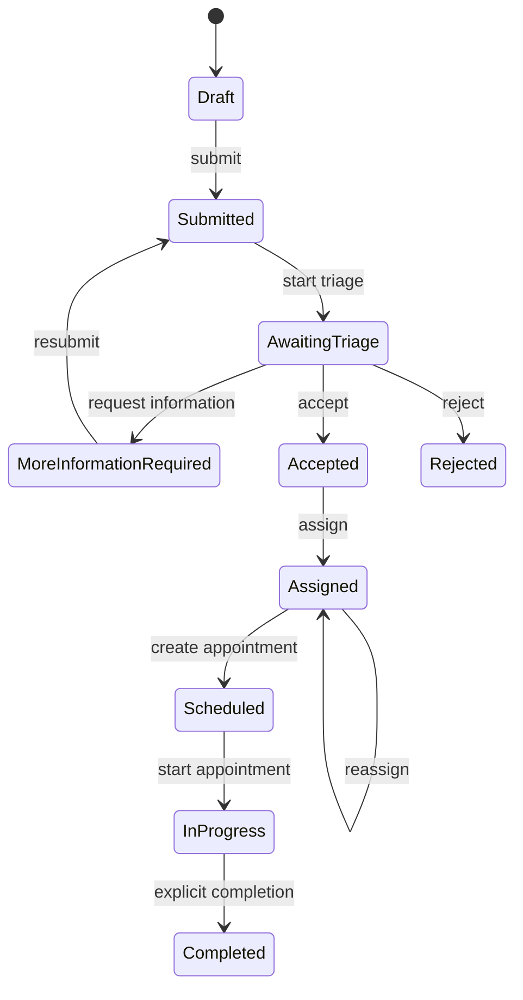
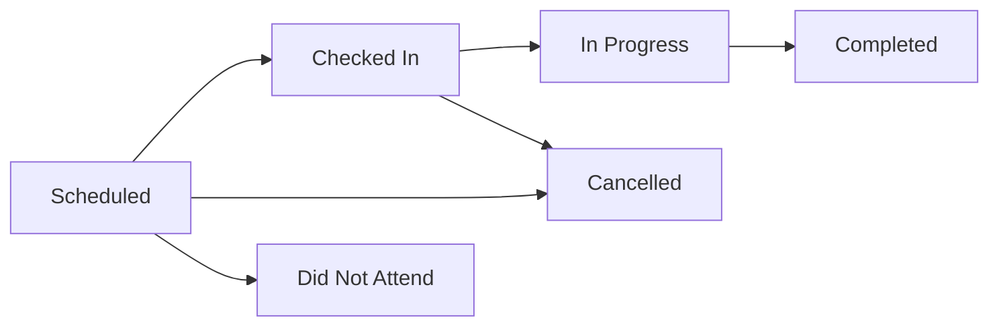

# Requirements

## Purpose

CareTrack is a portfolio demonstration of an internal clinical referral and workflow management system. The deployed application demonstrates how administrative and clinical teams can manage patients, referrals, appointments, and Clinical Notes through a structured workflow using synthetic data only.

CareTrack is not a production healthcare system and does not connect to real NHS systems or contain real patient data.

## Current Scope

### Implemented
- patient creation, lookup, search, and update
- referral creation and lifecycle management
- referral triage and acceptance/rejection flows
- referral assignment and reassignment
- referral history retrieval
- appointment creation and scheduling
- appointment workflow management
- clinical note creation, retrieval, listing, and update
- optimistic concurrency for patient updates
- transactional workflow coordination where multiple aggregates are affected
- Microsoft Entra ID authentication
- scope-, role-, and policy-based authorization
- authenticated user identity propagation into application services
- deterministic authentication/authorization integration testing
- SQL Server persistence with Entity Framework Core
- Problem Details-based API error handling
- Angular staff workspace with MSAL, role-aware presentation, and responsive workflow UI
- public recruiter landing page with two real Entra demo identities
- GitHub Actions deployment to Azure Static Web Apps and Azure App Service
- SQL-independent liveness and SQL-backed readiness endpoints
- guarded deterministic shared-demo reset

### Planned / Future

- operational reporting
- dedicated administrative features
- optional Microsoft Graph-based staff access management
- Playwright end-to-end testing
- optional scheduled demo reset if usage justifies it

### Out of Scope for v1
- diagnosis
- prescribing
- clinical decision support
- treatment recommendations
- medical AI
- connection to real NHS systems
- real patient data
- a patient self-service portal
- custom password, MFA, reset, or refresh-token infrastructure
- claims of clinical-safety certification or regulatory compliance

## Actors

### Referral Coordinator
Responsible for referral administration, patient registration/update, referral workflow management, assignment, and appointment scheduling.

### Clinician
Responsible for clinical reads, appointment workflow actions, and clinical notes. A Clinician may also satisfy referral-management policy where appropriate.

### Administrator
Reserved for future system-administration capabilities. Administrator is not a universal clinical superuser and does not automatically inherit clinical access.

### Patient
A Patient is currently a domain entity, not an authenticated CareTrack actor. Any future patient portal would require patient-to-identity mapping and resource-level authorization.

## Functional Requirements
- Enable creation and tracking of patient referrals through defined workflow states.
- Support referral submission, triage, acceptance, rejection, requests for more information, resubmission, assignment, reassignment, scheduling, and completion.
- Support appointment creation and lifecycle transitions.
- Record and retrieve clinical notes associated with appointments.
- Derive clinical-note creator identity from the authenticated user rather than from client-supplied data.
- Provide paginated and filterable search for core operational records.
- Reject invalid workflow transitions and conflicting operations using consistent API error responses.
- Preserve data integrity during concurrent and transactional operations.
- Enforce explicit authorization policies on all business endpoints.

## Non-Functional Requirements
- Security-focused access control and least privilege.
- Synthetic data only.
- Clear separation of Domain, Application, Infrastructure, and API concerns.
- Auditability of significant workflow changes where implemented.
- Maintainability through explicit architecture, tests, and documentation.
- Reliability of referral and appointment lifecycle rules.
- Deterministic automated testing for domain, application, persistence, API, and authorization behavior.
- HTTPS-capable API hosting.
- No committed credentials or secrets.

## Referral Workflow

`Cancelled` exists in the referral enum but has no implemented transition or endpoint.

## Appointment Workflow

## Key Scheduling Rules
- Appointment overlap checks use half-open time intervals.
- Overlap is evaluated for the same patient.
- Cancelled and Did Not Attend appointments do not block future scheduling.
- Completed appointments remain part of conflict detection.
- Creating an appointment for an Assigned referral transitions that referral to Scheduled atomically.
