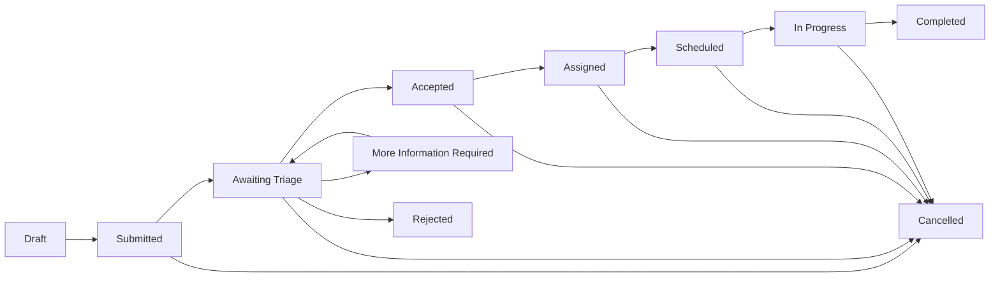

# Requirements

## Purpose
The proposed CareTrack system is intended to demonstrate how administrative and clinical teams could manage clinical referrals through a structured workflow in a portfolio context.

## Scope

### In scope (proposed)
- patient lookup and management
- referral creation
- triage
- assignment
- appointments
- referral status management
- case notes
- dashboards
- audit history

### Out of scope (proposed)
- diagnosis
- prescribing
- clinical decision support
- treatment recommendations
- medical AI
- connection to real NHS systems
- real patient data

## Actors
- Coordinator
- Clinician
- Service Manager

## Proposed Functional Requirements
- Enable creation and tracking of patient referrals through defined workflow stages.
- Support triage, assignment, scheduling, and status progression activities.
- Record key operational events such as case notes and audit history.
- Provide role-appropriate visibility for coordinators, clinicians, and service managers.

## Proposed Non-Functional Requirements
- Accessibility and inclusive interface design.
- Security-focused access control and data handling.
- Auditability of significant workflow actions.
- Maintainability via clear architecture and documentation.
- Reliability of core referral lifecycle processes.
- Performance suitable for operational queue management.
- Data quality controls to reduce duplicate or inconsistent records.
- Responsive interface behavior across common device sizes.

## Proposed Referral Workflow

