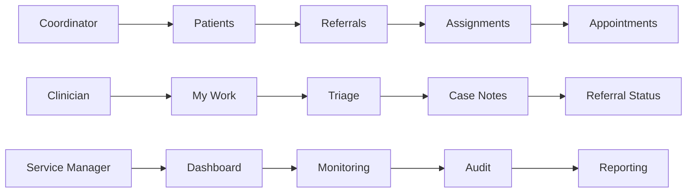

# Proposed User Stories

## Story 1: Coordinator creates referral
**As a** referral coordinator, **I want** to create a referral **so that** a patient can enter the appropriate workflow.

### Proposed Acceptance Criteria
- **Given** a patient record exists,
- **When** the coordinator submits referral details,
- **Then** the referral is recorded in an initial workflow state.

## Story 2: Clinician views assigned referrals
**As a** clinician, **I want** to view referrals assigned to me **so that** I can prioritise my workload.

### Proposed Acceptance Criteria
- **Given** referrals are assigned to the clinician,
- **When** the clinician opens their work view,
- **Then** assigned referrals are visible with key status information.

## Story 3: Service manager monitors delays
**As a** service manager, **I want** to view referral status information **so that** I can identify potential delays.

### Proposed Acceptance Criteria
- **Given** referrals are progressing through multiple states,
- **When** the service manager opens monitoring views,
- **Then** delayed or at-risk workflow items can be identified.

## Proposed User Role Flow

