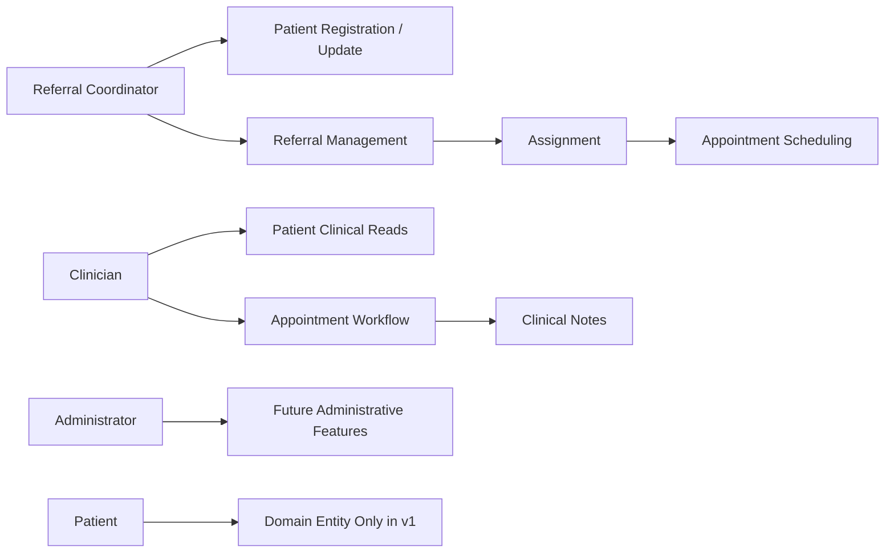

# User Stories

## Story 1: Referral Coordinator creates a patient
**As a** Referral Coordinator, **I want** to register a patient **so that** referrals can be created against a valid patient record.

### Acceptance Criteria
- **Given** the caller is authorized for ReferralManagement,
- **When** valid patient details are submitted,
- **Then** a patient record is created.

## Story 2: Referral Coordinator creates a referral
**As a** Referral Coordinator, **I want** to create a referral **so that** a patient can enter the referral workflow.

### Acceptance Criteria
- **Given** a valid patient exists,
- **When** valid referral details are submitted,
- **Then** a referral is created in Draft state.
- **And** the referral can progress through supported workflow transitions.

## Story 3: Referral Coordinator manages triage and assignment
**As a** Referral Coordinator, **I want** to progress and assign referrals **so that** work can reach the appropriate clinical team.

### Acceptance Criteria
- A submitted referral can enter Awaiting Triage.
- Triage information can be recorded.
- The referral can be accepted, rejected, or moved to More Information Required where allowed.
- Accepted referrals can be assigned and reassigned.
- Invalid state transitions return a conflict response.

## Story 4: Referral Coordinator schedules an appointment
**As a** Referral Coordinator, **I want** to create an appointment for an assigned referral **so that** clinical work can be scheduled.

### Acceptance Criteria
- Only referrals in an allowed scheduling state can be scheduled.
- Appointment overlap rules are checked for the same patient.
- Creating the appointment and progressing the referral to Scheduled occur atomically.
- Duplicate appointment references return a conflict response.

## Story 5: Clinician progresses an appointment
**As a** Clinician, **I want** to check in, start, complete, cancel, or mark an appointment as Did Not Attend where permitted **so that** the operational state reflects what happened.

### Acceptance Criteria
- Scheduled can move to Checked In.
- Checked In can move to In Progress.
- In Progress can move to Completed.
- Supported cancellation and Did Not Attend transitions are enforced.
- Invalid transitions return a conflict response.

## Story 6: Clinician records a clinical note
**As a** Clinician, **I want** to create and update a clinical note for an appointment **so that** relevant clinical documentation is associated with the encounter.

### Acceptance Criteria
- The request supplies note content only.
- `CreatedBy` is derived from the authenticated Entra object ID.
- Client-supplied `createdBy` data cannot override the authenticated identity.
- Notes can be retrieved by ID and by appointment.
- Updating content preserves the original creator identity.

## Story 7: Authorized staff search operational records
**As an** authorized staff member, **I want** to search and page through patients, referrals, and appointments **so that** I can locate operational work efficiently.

### Acceptance Criteria
- Search supports deterministic ordering and pagination.
- Role policy differs by resource and operation.
- Unauthorized callers receive 401 or 403 as appropriate.

## Story 8: Administrator performs future system administration
**As an** Administrator, **I want** to manage future system-level configuration **so that** CareTrack can be operated safely.

### Current Status
- `AdministrativeAccess` exists and is tested.
- No artificial admin endpoint has been created solely to exercise the role.
- Administrator does not automatically inherit clinical access.
- Future administrative features may include service locations, teams, configuration, audit views, or Microsoft Graph-backed staff access management.

## Current Role Flow

