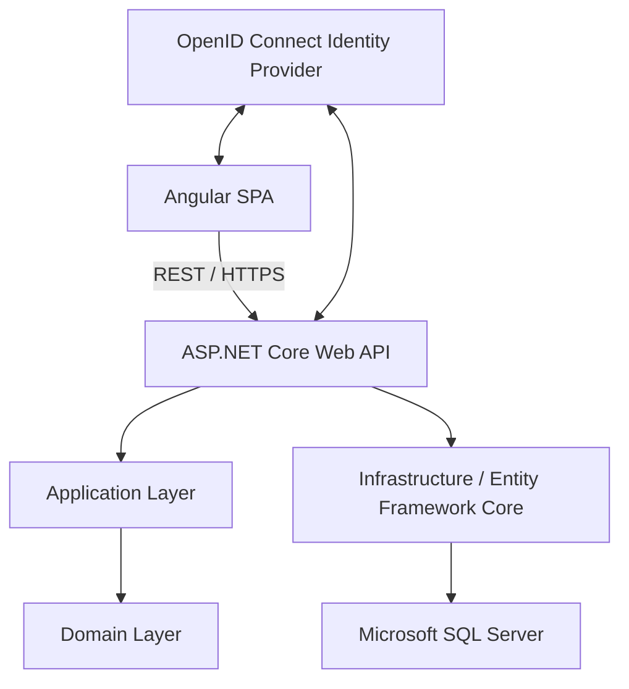

# Proposed System Architecture

This document describes a **proposed** architecture for future implementation only.

## Planned Layered Architecture
- Angular SPA
- REST/HTTPS communication
- ASP.NET Core Web API
- Application and Domain layers
- Infrastructure using Entity Framework Core and LINQ
- Microsoft SQL Server

## Planned Backend Projects
### CareTrack.Domain
Future responsibilities:
- domain model
- domain rules
- enums
- core abstractions

### CareTrack.Application
Future responsibilities:
- application use cases
- DTOs
- application interfaces
- orchestration
- validation

### CareTrack.Infrastructure
Future responsibilities:
- EF Core
- SQL Server integration
- persistence
- external infrastructure concerns

### CareTrack.Api
Future responsibilities:
- controllers
- REST API surface
- authorization
- middleware
- OpenAPI
- dependency injection composition

## Identity and Authentication Relationship (Planned)
- Angular SPA ↔ OpenID Connect Identity Provider for user authentication.
- ASP.NET Core API ↔ Identity Provider for access token validation.

## Proposed CareTrack System Architecture

