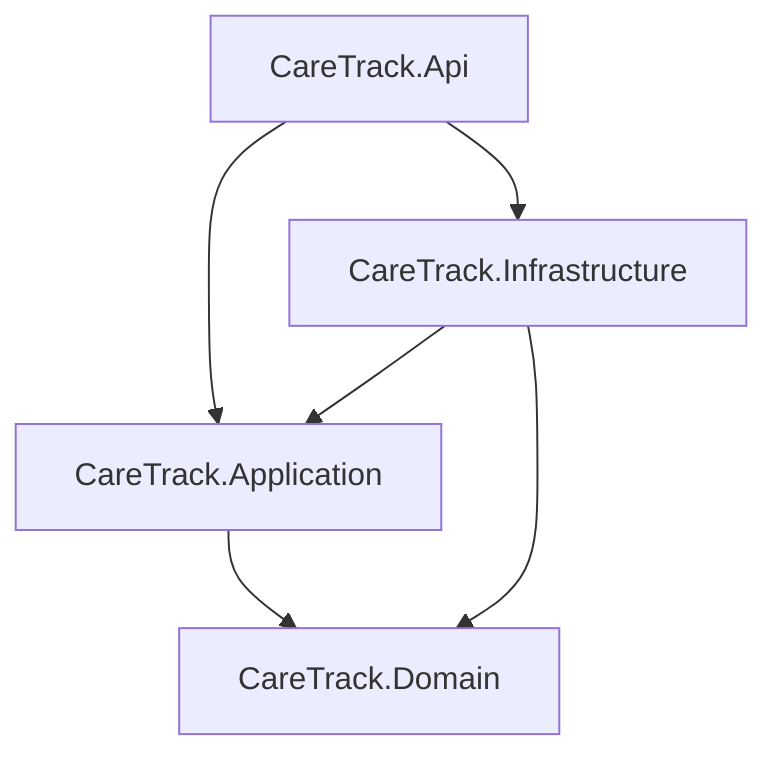
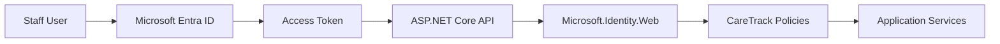
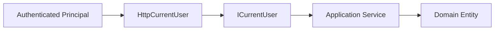

# System Architecture

## Current Status
The backend architecture is implemented. The Angular SPA remains the next major phase.

## Layered Architecture
- Angular SPA — planned for Phase 6
- REST/HTTPS communication
- ASP.NET Core Web API — implemented
- Application layer — implemented
- Domain layer — implemented
- Infrastructure layer using Entity Framework Core and LINQ — implemented
- Microsoft SQL Server — implemented
- Microsoft Entra ID authentication — implemented
- Microsoft.Identity.Web bearer-token validation — implemented

## Backend Projects

### CareTrack.Domain
Responsibilities:
- domain entities
- workflow rules
- enums
- aggregate state transitions
- domain invariants

The Domain layer has no dependency on Entra, JWT, HTTP, Entity Framework Core, or ASP.NET Core.

### CareTrack.Application
Responsibilities:
- application use cases
- orchestration
- application commands/results
- interfaces such as repositories, transactions, and `ICurrentUser`
- translation of domain transition failures into application-level exceptions

Application depends on Domain, but not on API or Infrastructure.

### CareTrack.Infrastructure
Responsibilities:
- Entity Framework Core
- SQL Server persistence
- repository implementations
- transaction implementation
- database mappings and migrations

Infrastructure depends on Application and Domain.

### CareTrack.Api
Responsibilities:
- REST controllers
- request/response contracts
- Microsoft Entra bearer authentication
- named authorization policies
- `HttpCurrentUser`
- global exception handling / Problem Details
- OpenAPI in Development
- dependency-injection composition
- health endpoint

API depends on Application and Infrastructure.

## Project Dependency Direction



## Identity Architecture



## Current User Boundary



`ICurrentUser` lives in Application. `HttpCurrentUser` lives in API and derives the current user from trusted object-ID claims.

## Cross-Aggregate Orchestration
Cross-aggregate workflow coordination belongs in the Application layer. Examples include:
- creating an appointment and transitioning an Assigned referral to Scheduled atomically
- starting an appointment and progressing a Scheduled referral to In Progress
- explicit referral completion checks across related appointments

Domain entities remain responsible for their own state-transition rules.

## Planned Frontend Architecture
Phase 6 will add:
- Angular
- MSAL Angular
- Authorization Code Flow with PKCE
- protected API calls using Entra access tokens

## Temporary Authentication Tool
A temporary development authentication client is retained under:

```text
tools/CareTrack.AuthTestClient/
```

It is used for real Entra token verification until Angular/MSAL becomes the primary interactive client.
