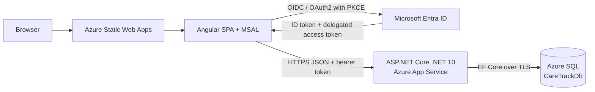
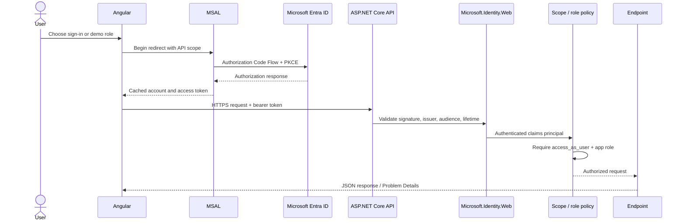
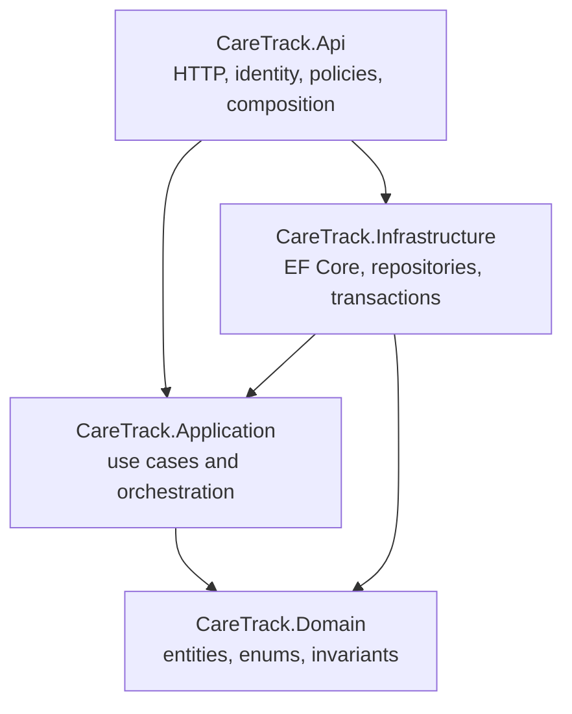
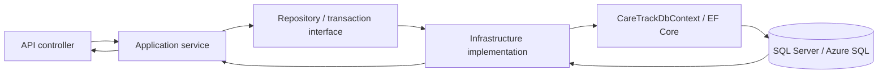
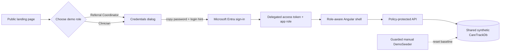
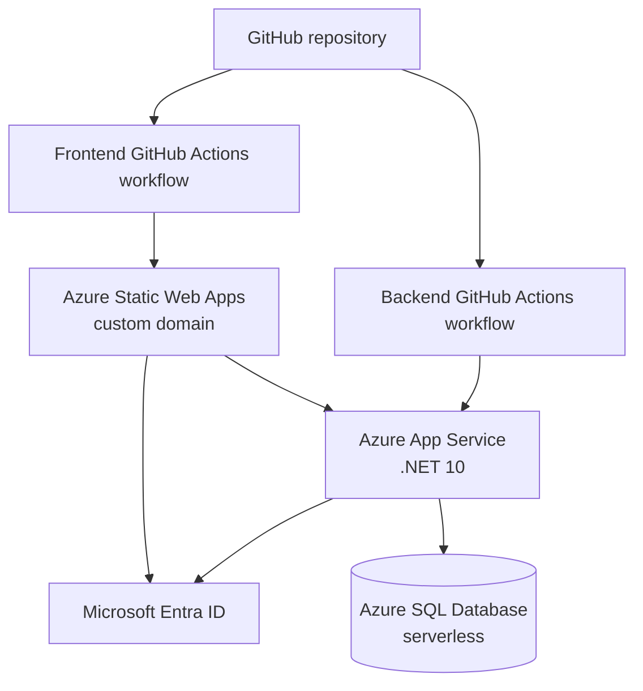
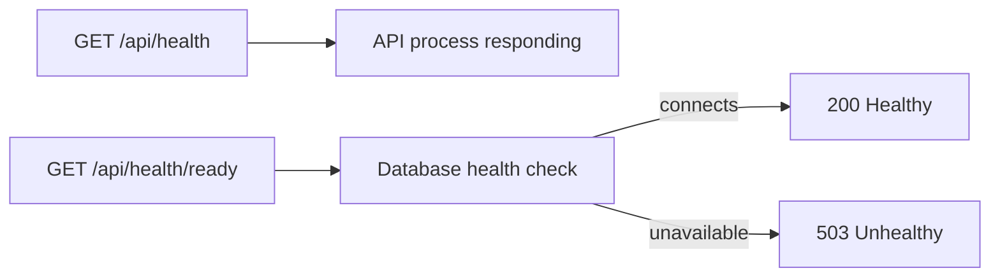

# System Architecture

CareTrack is a deployed Angular and ASP.NET Core portfolio application. The architecture deliberately separates browser authentication, API authorization, application orchestration, domain rules, and SQL persistence.

## High-Level Production Architecture

- Public content and recruiter role selection are served by the Angular application.
- Entra performs sign-in. The SPA contains no client secret.
- The API accepts the delegated `access_as_user` token, not an ID token, for business calls.
- Azure SQL contains one shared synthetic demo dataset.

## Request and Authentication Flow

`401 Unauthorized` means authentication is absent or unsuccessful. `403 Forbidden` means a valid authenticated caller does not meet the endpoint's scope/role policy. Angular uses role-aware presentation, but the API policy is authoritative.

## Backend Clean Architecture Boundaries

| Project | Owns | Must not own |
| --- | --- | --- |
| `CareTrack.Domain` | entities, state transitions, invariants, enums | HTTP, JWT, EF Core, Azure concerns |
| `CareTrack.Application` | commands/results, use cases, repository/transaction interfaces, cross-aggregate coordination | controllers or persistence implementations |
| `CareTrack.Infrastructure` | EF Core mappings, SQL repositories, migrations, transaction implementation | HTTP or business-policy shortcuts |
| `CareTrack.Api` | contracts, controllers, Problem Details, Entra validation, policies, current-user adapter, health endpoints, DI | domain state mutation outside use cases |

The folder spelling `Persistance` is an established project path and is intentionally preserved.

## Database and Persistence Flow

Entity Framework migrations live in `CareTrack.Infrastructure/Migrations`. The API does not run migrations on startup; deployment and operators apply them explicitly. Patient updates use a SQL row version for optimistic concurrency. Cross-aggregate scheduling/start operations use explicit transactions, and retry verification queries persisted state after clearing tracked entities.

Appointment list/search is a read-side exception to aggregate loading: an Application query contract is implemented in Infrastructure using the keyless `vw_AppointmentOperationalList` projection. The existing API policy and endpoint remain in place, while Angular receives patient display name/reference and referral reference in the paged response. Transactional appointment commands continue through repositories and domain behavior.

## Cross-Aggregate Orchestration

The Application layer coordinates operations that touch more than one aggregate:

- Appointment creation validates the patient/referral relationship and scheduling eligibility, protects the overlap check with serializable isolation, creates the appointment, and moves an `Assigned` referral to `Scheduled` in the same transaction.
- Appointment start moves a `Scheduled` referral to `InProgress` in the same retry-safe transaction.
- Appointment completion updates only the appointment.
- Explicit referral completion checks all related appointments: at least one must be completed and none may remain `Scheduled`, `CheckedIn`, or `InProgress`.

Domain entities still own the legality of their individual state transitions.

## Demo Environment Flow

The demo accounts are real restricted Entra identities. `GET /api/me` marks configured object IDs with `isDemoAccount` so the UI can display the synthetic-data banner. That flag is not consulted by authorization. Visitors share one database; the guarded seeder periodically/manually restores a deterministic baseline.

## Deployment Topology

Frontend and backend deploy independently on `main`. The frontend workflow builds Angular and uploads the static artifact. The backend workflow restores, builds, runs unit tests, publishes, deploys with a GitHub secret, and verifies API liveness. Integration tests are intentionally not run by the current backend workflow because they require the developer-provided SQL integration database.

## Health and Readiness Model

- Liveness never queries SQL and is used by post-deployment verification.
- Readiness verifies database connectivity and returns sanitized JSON.
- Azure SQL serverless can briefly make readiness unavailable while resuming.
- App Service platform Health Check is not enabled because the current free hosting tier does not support it. This is a hosting-plan limitation, not a missing application endpoint. `/api/health/ready` is ready to configure after an upgrade.

Related documents: [API design](05-api-design.md), [authentication and authorization](06-authentication-authorization.md), [deployment](10-deployment.md), [workflows](11-workflows.md), and [engineering decisions](12-engineering-decisions.md).
