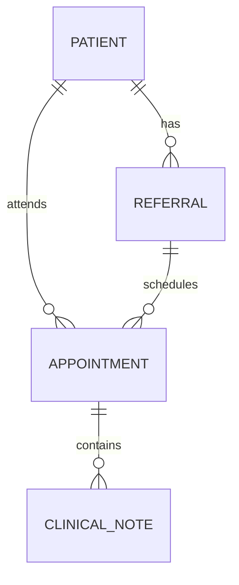

# Database Design

## Current Status
Core SQL Server persistence is implemented using Entity Framework Core migrations.

The original planning model included several speculative entities. The implemented v1 backend intentionally uses a smaller model focused on the referral workflow.

## Implemented Core Entities

### Patient
Represents a synthetic patient record.

Key concerns:
- unique patient identity/reference
- demographic data
- optimistic concurrency for updates
- one-to-many relationship with referrals and appointments

### Referral
Represents a referral moving through the CareTrack workflow.

Key concerns:
- referral reference
- patient relationship
- priority and reason
- workflow status
- triage data
- assignment data
- workflow timestamps
- history retrieval

### Appointment
Represents a scheduled clinical encounter associated with a patient and referral.

Key concerns:
- appointment reference
- patient and referral foreign keys
- appointment type
- scheduled start/end
- location
- operational status
- check-in/start/completion/cancellation/DNA timestamps

### ClinicalNote
Represents a note associated with an appointment.

Key concerns:
- appointment foreign key
- content
- `CreatedBy` derived from authenticated user identity
- created/updated timestamps
- no delete endpoint in the current API
- appointment deletion is restricted when clinical notes exist

## Important Relationships



## Data Integrity Decisions
- SQL Server foreign keys protect relationships.
- Appointment deletion is restricted when clinical notes exist.
- Patient updates use optimistic concurrency.
- Duplicate references are protected at the application/database boundary.
- Whitespace-normalized duplicate references are rejected.
- Appointment scheduling uses transactional overlap protection.
- Cross-aggregate scheduling changes use an application transaction.

## Appointment Conflict Rule
The overlap rule is:

```text
existing.Start < requestedEnd
AND
existing.End > requestedStart
```

This models half-open intervals and allows back-to-back appointments.

Conflict checking is performed for the same patient. Cancelled and Did Not Attend appointments do not block scheduling; Completed appointments still count as historical scheduled occupancy.

## Appointment Operational Read Model

`dbo.vw_AppointmentOperationalList` is a narrow, read-only SQL Server view for the appointment list/search path. It joins appointments to the patient name/reference and referral reference that the table displays. It deliberately excludes date of birth, referral reason, triage notes, Clinical Note content, identity fields, and unused workflow timestamps.

Infrastructure maps the view as an EF Core keyless read model. Application owns the immutable outward query result, and the existing clinician-authorized appointment endpoint uses that result without exposing SQL/view concepts. Appointment creation, overlap checks, and workflow transitions remain domain/application-driven EF operations against transactional tables.

The view is versioned through an EF Core migration and removes the browser's per-page patient/referral enrichment fan-out. No elapsed-time or percentage improvement is claimed yet; execution-plan benchmarking and evidence-led index decisions are deferred to Phase 8E.

## Identity Data
CareTrack currently does not maintain a local password/user-account table.

Microsoft Entra ID is the identity provider. Where application records need the authenticated user identity, CareTrack stores the stable Entra object ID supplied by the trusted authentication boundary.

## Deferred Data Concepts
Not currently implemented as first-class v1 entities:
- local APP_USER credential store
- Specialty
- dedicated ReferralAssignment entity
- dedicated system-wide AuditEvent entity
- administrative configuration entities
