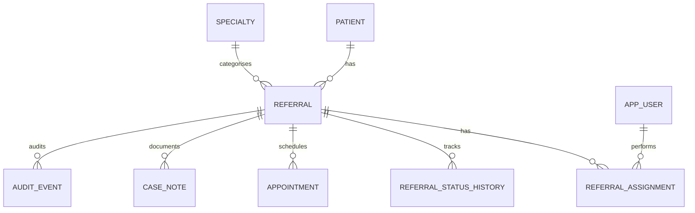

# Proposed Database Design

This document captures a **proposed** high-level data model for future implementation.

## Planned Entities
- APP_USER
- PATIENT
- SPECIALTY
- REFERRAL
- REFERRAL_ASSIGNMENT
- REFERRAL_STATUS_HISTORY
- APPOINTMENT
- CASE_NOTE
- AUDIT_EVENT

## Proposed High-Level Relationships
- A patient may have multiple referrals.
- A specialty may be linked to multiple referrals.
- A referral may have multiple assignments over time.
- Assignments link referrals to application users.
- A referral may have many status history events.
- A referral may have multiple appointments.
- A referral may have multiple case notes.
- A referral may have many audit events.

## Future Data Design Considerations
- primary keys
- foreign keys
- referential integrity
- indexes
- concurrency
- transactions
- auditability
- data quality

## Proposed CareTrack Data Model

