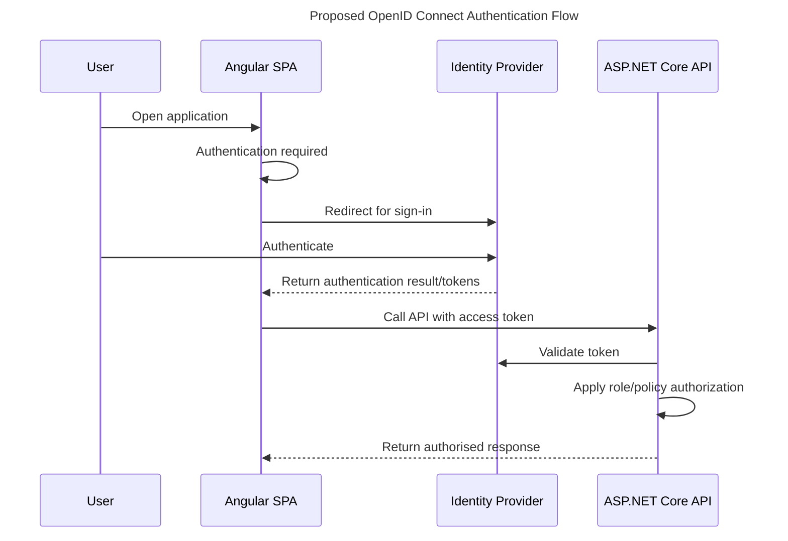

# Planned Authentication & Authorization

This document describes a **proposed** authentication and authorization model only.

## Planned Approach
- OAuth 2.0 for delegated authorization concepts.
- OpenID Connect for user authentication flows.
- Role-based authorization in the API and application UI.

## Planned Roles
- Coordinator
- Clinician
- ServiceManager

## Proposed OpenID Connect Authentication Flow

No credentials, tenant identifiers, or implementation configuration are included in this planning stage.
