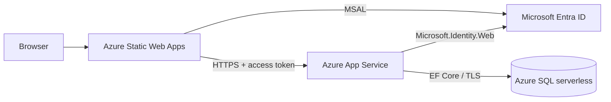

# Production Deployment

CareTrack is deployed as a synthetic-data portfolio application. Infrastructure changes are intentionally outside normal application deployment; this document explains the existing topology without exposing credentials.

## Production Topology

| Component | Production service | Address / database |
| --- | --- | --- |
| Frontend | Azure Static Web Apps | [https://caretrack.hussnainali.me](https://caretrack.hussnainali.me) |
| Backend | Azure App Service, ASP.NET Core .NET 10 | `https://caretrack-api-g3ghhnddhefvg8c4.centralus-01.azurewebsites.net` |
| Database | Azure SQL Database serverless | `CareTrackDb` |
| Identity | Microsoft Entra ID | separate SPA and protected-API app registrations |

## Frontend

The Angular production environment targets the production API and custom-domain redirect URI. `.github/workflows/azure-static-web-apps-salmon-river-0c84f3410.yml`:

1. runs on pushes and pull requests targeting `main`;
2. installs Node.js 24 and uses `npm ci`;
3. runs the production `npm run build`;
4. verifies the generated entry point, Static Web Apps routing file, and referenced JS/CSS assets;
5. uploads `frontend/caretrack-web/dist/caretrack-web/browser` to Azure Static Web Apps;
6. uses a GitHub secret for the Static Web Apps deployment token.

Pull-request environments are closed when the pull request closes. SPA navigation fallback is configured in `frontend/caretrack-web/public/staticwebapp.config.json`.

## Backend

The API targets `net10.0` and is hosted by Azure App Service. `.github/workflows/backend-api.yml`:

1. runs for backend changes on pushes and pull requests targeting `main`;
2. restores and Release-builds `backend/CareTrack.slnx`;
3. runs the backend unit suite;
4. publishes `CareTrack.Api` and uploads a short-lived workflow artifact;
5. deploys pushes to `main` with an App Service publish profile held in GitHub secrets;
6. retries `GET /api/health` after deployment.

The current workflow does not run the SQL Server integration suite because that suite expects a separately provisioned local/integration database.

## Database and Migrations

- Production uses Azure SQL Database serverless.
- EF Core mappings and migrations are owned by `CareTrack.Infrastructure`.
- The API does **not** call `Database.Migrate()` at startup.
- Migrations must be reviewed and applied explicitly before code that depends on them is deployed.
- The deterministic demo seeder is a separate guarded operator tool, not a migration mechanism.
- The seeder requires `CareTrackDb`, rejects pending migrations, requires exact interactive confirmation, resets domain tables transactionally, and preserves `__EFMigrationsHistory`.

Example migration commands are documented in [local development](14-local-development.md). Do not put a production connection string on the command line or in source.

## Microsoft Entra Configuration

The identity setup uses:

- an SPA app registration with the permitted frontend redirect URIs;
- an API app registration exposing delegated scope `access_as_user`;
- app roles `Clinician`, `ReferralCoordinator`, and `Administrator`;
- user/app-role assignments for the intended identities;
- MSAL Authorization Code Flow with PKCE in Angular;
- Microsoft.Identity.Web bearer validation in the API.

There is no client secret in the SPA. Public app/tenant identifiers are intentionally not repeated in this document; use placeholders in private setup notes and obtain real values from the relevant Entra registrations.

## Runtime Configuration

Production values are managed in Azure App Service environment/application settings and connection-string settings. Relevant names include:

| Setting | Purpose |
| --- | --- |
| `ASPNETCORE_ENVIRONMENT` | selects Production behavior |
| `ASPNETCORE_FORWARDEDHEADERS_ENABLED` | respects platform-forwarded headers |
| `AzureAd__TenantId` | Entra tenant used to validate API tokens |
| `AzureAd__ClientId` | protected API application/client ID |
| `ConnectionStrings__CareTrack` or App Service `CareTrack` connection string | Azure SQL connectivity |
| `Cors__AllowedOrigins__0` | permitted Angular origin if overriding checked-in production configuration |
| `ReferralAssignment__Targets__{n}` | canonical configured clinical-team names if overridden |

Production CORS is restricted to `https://caretrack.hussnainali.me`. HTTPS Only and a supported minimum TLS version should remain enabled. Connection strings, SQL credentials, tokens, demo passwords, publish profiles, and tenant secrets must never be committed.

## Health and Readiness

| Endpoint | Meaning | SQL query | Response |
| --- | --- | --- | --- |
| `GET /api/health` | process liveness | No | `200` while the API process responds |
| `GET /api/health/ready` | dependency readiness | Connectivity check | sanitized `200` healthy or `503` unhealthy |

The backend deployment workflow verifies liveness. Azure SQL serverless can cold-start, so readiness may briefly return `503` while the database resumes.

Azure App Service platform Health Check is **currently unavailable on the application's free tier and is not enabled**. This is a hosting-plan limitation. The application readiness endpoint already exists and should be configured as `/api/health/ready` if the App Service plan is upgraded.

## Safe Release Sequence

1. Review migrations and configuration changes; back up only when the change requires it.
2. Apply pending EF migrations explicitly to the intended database.
3. Merge application changes to `main` to trigger the relevant independent workflow(s).
4. Confirm workflow build/test/deployment results.
5. Verify frontend load and authentication redirect.
6. Verify `/api/health`, then `/api/health/ready`.
7. Exercise one least-privilege path for each affected role.
8. Confirm CORS and logs contain no sensitive values.

## Operational Boundaries

- No automatic startup migration or startup seeding occurs.
- No Azure resource should be created or modified as part of documentation-only work.
- The shared demo can contain visitor changes until an operator runs the guarded reset.
- Availability, throughput, and clinical production fitness have not been load-tested or certified.
