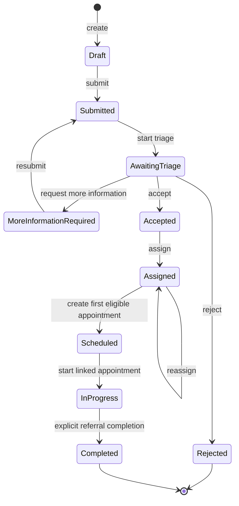
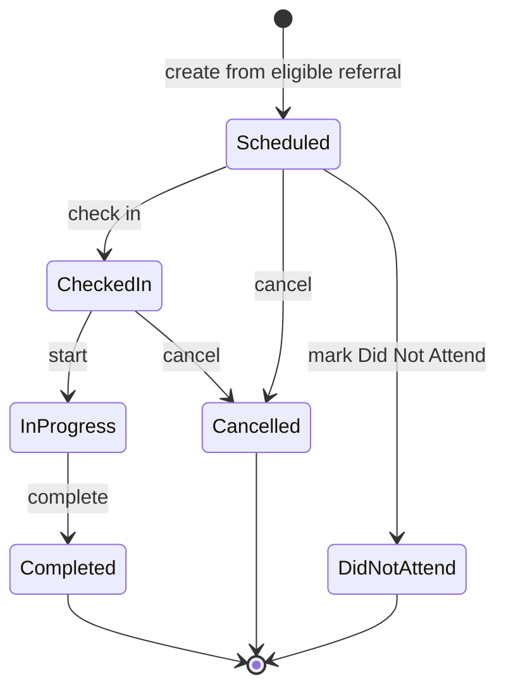
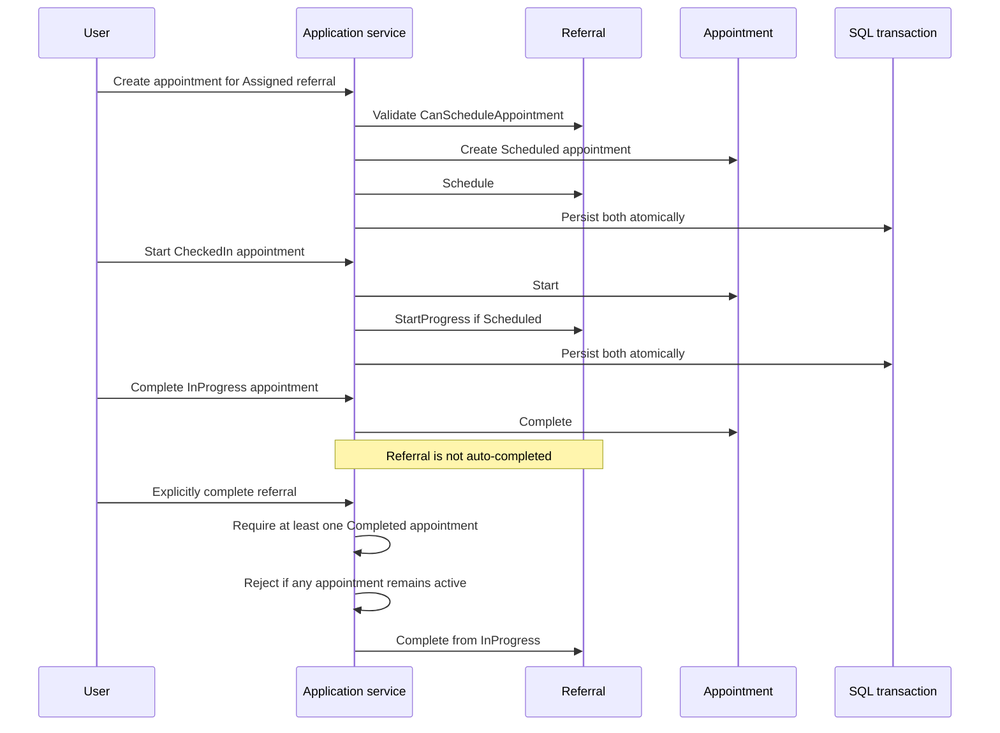

# Workflow Model

CareTrack uses explicit domain methods and endpoint-specific commands rather than allowing clients to set a status directly. Invalid transitions are returned as `409 Conflict`.

## Referral Lifecycle

Triage assessment records a priority and note while the referral remains `AwaitingTriage`. Additional appointments can be created while a referral is `Scheduled` or `InProgress` without repeating the referral transition.

`Cancelled` exists in `ReferralStatus`, but the current `Referral` entity has no cancellation method and the API has no referral-cancellation endpoint. The enum value must not be read as an implemented transition.

## Appointment Lifecycle

An appointment cannot be started before check-in, completed before it is InProgress, cancelled after it starts, or marked Did Not Attend after leaving Scheduled.

## Referral / Appointment Orchestration

Referral completion requires:

1. the referral is `InProgress`;
2. at least one related appointment exists and is `Completed`;
3. no related appointment remains `Scheduled`, `CheckedIn`, or `InProgress`.

This keeps referral closure deliberate and visible even after clinical appointment work is completed.
